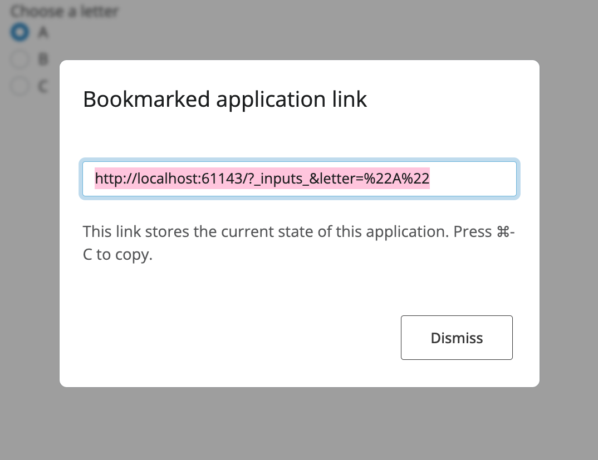

## Introduction

Bookmarking in Shiny for Python allows users to save and restore the state of an application. This makes it possible to share specific application states via URLs or to restore previous sessions. Think of it as taking a snapshot of your app's current state that can be loaded later.

Bookmarking is particularly useful for:

- Sharing a specific view or configuration with colleagues
- Preserving analysis parameters for reproducibility
- Enabling users to resume where they left off
- Creating shareable links to specific data views or visualizations

## Enable Bookmarking

Bookmarking works by updating the URL whenever specified `input` values change. To achieve automatic bookmarking within your app, you'll need a few updates to your app structure.


::: {.panel-tabset .panel-pills}

### Express

<!-- NOTE: Have the same numbered list (no sub-list) for hover code annotations below the code! -->
1. **Set the `bookmark_store` app option parameter** within your app
2. **Integrate bookmarking callbacks** to update the URL
3. **Trigger bookmarking** when desired inputs change

```{.python}
from shiny import reactive
from shiny.express import app_opts, input, render, session, ui

app_opts(bookmark_store="url") # or "server"                    # <1>

@session.bookmark.on_bookmarked                                 # <2>
async def _(url: str):                                          # <2>
    await session.bookmark.update_query_string(url)             # <2>

@reactive.effect                                                # <3>
@reactive.event(input.n, input.dist, ignore_init=True)          # <3>
async def _():                                                  # <3>
    await session.bookmark()                                    # <3>

ui.page_opts(title="Bookmarking Example")

ui.input_slider("n", "Sample size", min=10, max=100, value=30)
ui.input_radio_buttons(
    "dist",
    "Distribution",
    choices=["Normal", "Uniform", "Exponential"]
)

@render.plot
def plot():
    import numpy as np
    import matplotlib.pyplot as plt

    # Generate data based on inputs
    if input.dist() == "Normal":
        data = np.random.normal(size=input.n())
    elif input.dist() == "Uniform":
        data = np.random.uniform(size=input.n())
    else:
        data = np.random.exponential(size=input.n())

    fig, ax = plt.subplots()
    ax.hist(data, bins=20)
    return fig
```

1. **Set the `bookmark_store` app option parameter** within your app
2. **Integrate bookmarking callbacks** to update the URL
3. **Trigger bookmarking** when desired inputs change


### Core

<!-- NOTE: Have the same numbered list (no sub-list) for hover code annotations below the code! -->
1. **Define your UI as a function** that accepts a starlette `Request` parameter and returns the UI layout. This allows Shiny to extract bookmark data from the URL during UI restoration.
2. **Integrate bookmarking callbacks** to update the URL (within the `server` function)
3. **Trigger bookmarking** when desired inputs change (within the `server` function)
4. **Set the `bookmark_store` parameter** when creating your `App()` object

```{.python}
from starlette.requests import Request
from shiny import App, Inputs, Outputs, Session, reactive, render, ui
import numpy as np
import matplotlib.pyplot as plt


def app_ui(request: Request):                                           # <1>
    return ui.page_fluid(                                               # <1>
        ui.input_slider("n", "Sample size", min=10, max=100, value=30), # <1>
        ui.input_radio_buttons(                                         # <1>
            "dist",                                                     # <1>
            "Distribution",                                             # <1>
            choices=["Normal", "Uniform", "Exponential"]                # <1>
        ),                                                              # <1>
        ui.output_plot("plot")                                          # <1>
    )

def server(input: Inputs, output: Outputs, session: Session):
    @session.bookmark.on_bookmarked                         # <2>
    async def _(url: str):                                  # <2>
        await session.bookmark.update_query_string(url)     # <2>

    @reactive.effect                                        # <3>
    @reactive.event(input.n, input.dist, ignore_init=True)  # <3>
    async def _():                                          # <3>
        await session.bookmark()                            # <3>

    @render.plot
    def plot():
        # Generate data based on inputs
        if input.dist() == "Normal":
            data = np.random.normal(size=input.n())
        elif input.dist() == "Uniform":
            data = np.random.uniform(size=input.n())
        else:
            data = np.random.exponential(size=input.n())

        fig, ax = plt.subplots()
        ax.hist(data, bins=20)
        return fig

app = App(app_ui, server, bookmark_store="url") # <4>
```

1. **Define your UI as a function** that accepts a starlette `Request` parameter and returns the UI layout. This allows Shiny to extract bookmark data from the URL during UI restoration.
2. **Integrate bookmarking callbacks** to update the URL (within the `server` function)
3. **Trigger bookmarking** when desired inputs change (within the `server` function)
4. **Set the `bookmark_store` parameter** when creating your `App()` object


:::


## Bookmark Button

The simplest way to let users create bookmarks is to add a bookmark button to your UI:

```{.python}
ui.input_bookmark_button(label="Save current state")
```

When clicked, this button triggers the bookmarking process. This will update the URL if `session.bookmark.update_query_string()` has been registered or will display the bookmark URL to the user in a modal if nothing has been registered with `session.on_bookmarked`.

::: {.callout-tip}
## Disable automatic bookmarking

It is recommended to remove the `await session.bookmark()` call when using the bookmark button to avoid extraneous bookmark updates. By default, Shiny listens for when a (non-module) bookmark button is clicked and calls `await session.bookmark()` automatically.
:::

## Bookmark Overlay

To provide an obvious URL interaction with the bookmarking process, you can use the bookmark overlay. This overlay displays the bookmark URL and allows users to copy it easily.

When executed, `session.bookmark.show_overlay()` will display a modal similar to the following:





## Excluding `input`s from Bookmarks

Not every input is bookmark-worthy; some `input`s should not be bookmarked. For example, if you wanted to exclude `input.n` from the bookmark to force it to reset on every app load, you can call:

```{.python}
session.bookmark.exclude.append("n")
```

By default, password inputs are excluded from bookmarking to protect sensitive information.

The `session.bookmark.exclude` list can be modified at any time during the server function execution and within modals.


## Bookmarking Tabs

When using tabbed interfaces, you'll want to bookmark which tab is active. To enable this, add an `id` parameter to your tabset:

::: {.panel-tabset .panel-pills}

### Express

```{.python}
from shiny.express import ui
from starlette.requests import Request

ui.page_opts(title="Tabbed App")

with ui.navset_tab(id="main_tabs"):
    with ui.nav_panel("Plot"):
        "Plot content here"

    with ui.nav_panel("Data"):
        "Data content here"

    with ui.nav_panel("About"):
        "About content here"
```

### Core

```{.python}
def app_ui(request: Request):
    return ui.page_fluid(
        ui.navset_tab(
            ui.nav_panel("Plot", "Plot content here"),
            ui.nav_panel("Data", "Data content here"),
            ui.nav_panel("About", "About content here"),
            id="main_tabs"  # This enables tab bookmarking
        )
    )
```

:::

With the `id` parameter set, the active tab will be included in the bookmark state.

::: {.callout-tip}
## Need more control?

For advanced bookmarking scenarios like saving custom values, using bookmark lifecycle callbacks, server-side storage, or bookmarking with modules, see [Advanced Bookmarking](bookmarking-advanced.qmd).
:::

## Bookmarking Styles

Bookmarks are created by calling `await session.bookmark()`. This function captures the current state of all `input`s (except those explicitly excluded) and saves it according to the configured bookmarking style (URL or server).

Shiny provides two approaches for storing bookmarked state:

### URL Bookmarking

With URL bookmarking, the application state is encoded directly in the URL query string. This makes sharing as simple as copying a link, but has some limitations:

**Advantages:**

- Easy to share \- just copy the URL
- No server-side storage required
- Works across any deployment

**Limitations:**

- URL length limits (~65,000 characters)
- State is visible in the URL
- Not suitable for sensitive data

**Example URL:**
```
https://myapp.example.com/?_inputs_&choice=%22B%22&number=42
```

### Server-side Bookmarking

With server-side bookmarking, the state is stored on the server with a unique identifier in the URL:

**Advantages:**

- No character URL size limitations; Data is stored server-side
- State is not visible in URL
- Can include files and large data structures

**Limitations:**

- Requires server-side storage configuration
- Bookmarks are tied to that server
- May need cleanup policies for old bookmarks

**Example URL:**
```
https://myapp.example.com/?_state_id_=d80625dc681e913a
```

::: {.callout-tip}
Use URL bookmarking if your state can fit in ~65k characters. It's simpler to set up and more portable. This is great for smaller apps. However, generative-AI apps or apps with data uploads may require or are better suited to server-side bookmarking.
:::

## Best Practices

* **Always make your UI a function** (core only) that accepts a `Request` parameter - this is required for bookmarking to work.

* **Update the query string** - Use `session.bookmark.update_query_string()` in an `on_bookmarked` callback to keep the browser URL in sync.

* **Use URL bookmarking when possible** - it's simpler and more portable than server bookmarking.

* **Exclude transient inputs** - Action buttons, file uploads, and other temporary controls usually shouldn't be bookmarked.

* **Test restoration thoroughly** - Load your app with bookmarked URLs to ensure state is restored correctly.

* **Consider URL size limits** - Keep bookmarked state compact for URL bookmarking (~65k character limit).

## Limitations

- **URL length limits**: Browsers limit URL length to approximately 65,000 characters. Use server bookmarking for larger state.

- **File uploads**: File inputs should not be bookmarked with URL storage with most files being too large to store within the URL. With server storage, you need custom logic to save/restore files.

- **Security**: URL bookmarks are visible to users / their browser. Do not include sensitive information in URL bookmarks.

## See Also

- [Advanced Bookmarking](bookmarking-advanced.qmd) - Custom values, lifecycle callbacks, and server-side storage
- [Bookmarking with Modules](bookmarking-modules.qmd) - Using bookmarking with Shiny modules
- [Modules](modules.qmd) - Organizing code with modules
- [Persistent Storage](persistent-storage.qmd) - Saving data between sessions
- [Reactivity Patterns](reactive-patterns.qmd) - Working with reactive values
