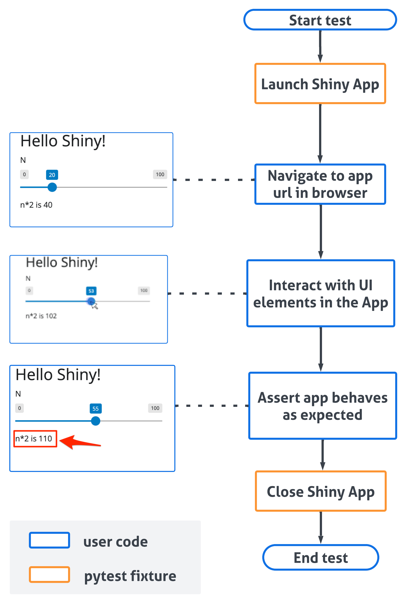

### What is End-to-End Testing (and Why Should You Care)?

Imagine you've built a beautiful, interactive Shiny app.  You want to make sure everything works exactly as expected, every time, for every user.  That's where end-to-end testing comes in.

**What it is:**

*   End-to-end testing checks your *entire* Shiny app, from start to finish, as if a real person were using it.
*   It simulates user actions like clicking buttons, filling in forms, and navigating between different parts of your app.
*   It verifies that the app's outputs (like graphs, tables, and text) are correct based on those actions.

**Why it's awesome:**

*   **Early bug detection:**  Find problems *before* your users do!  No more embarrassing surprises.
*   **Confidence in changes:**  When you update your app, tests make sure you haven't accidentally broken anything.
*   **Time saver:**  Instead of manually clicking through your app every time you make a change, tests automate the process.
*   **Peace of mind:**  Know that your app is working reliably, so you can focus on building new features.

### Introducing Playwright: A Comprehensive Automated Testing Solution for Web Applications

***Playwright*** is a robust, open-source automation framework developed by Microsoft that enables programmatic control of web browsers. This tool provides developers with the capability to automate interactions with web applications across Chrome, Firefox, and Safari, simulating user behavior in a controlled, reproducible environment.

**Why Playwright is perfect for Shiny:**

*   **Handles interactivity:**  It can interact with all those cool Shiny widgets like sliders, dropdowns, and buttons.
*   **Cross-browser testing:**  Make sure your app works flawlessly on different browsers.
*   **Smart waiting:** Playwright automatically waits for your app to load and for elements to be ready, so your tests are reliable.
*   **Easy to learn:**  The code is relatively straightforward, and we'll walk you through it.

Learn more at the [official Playwright documentation](https://playwright.dev/python/).

### Let's Build and Test a Simple Shiny App!

We'll start with a super simple example to show you the basics.  Follow along, and you'll be writing your own tests in no time!

#### Step 1: Create Your First Shiny App

First, let's create a tiny Shiny app with just a slider and some text.

1.  **Create a new file:**  Create a file named `app.py`.
2.  **Copy and paste this code:**

```python
from shiny.express import input, render, ui

ui.panel_title("Hello Shiny!")
ui.input_slider("n", "N", 0, 100, 20)


@render.text
def txt():
    return f"n*2 is {input.n() * 2}"

```

3.  **What this app does:** This app displays a slider (labeled "N") that goes from 0 to 100.  Below the slider, it shows the text "n*2 is \[value]", where \[value] is twice the current slider value.

#### Step 2:  What Are We Testing?

Our goal is to write a test that does the following:

1.  **Opens the app:**  Starts the Shiny app in a browser.
2.  **Moves the slider:**  Sets the slider to a specific value (*55* in this case).
3.  **Checks the output:**  Verifies that the text below the slider displays the correct result ("n*2 is 110").

#### Step 3:  Write Your First Test!

Now for the exciting part – writing the test code!

1.  **Create a new file:** Create a new file named `test_basic_app.py` in the same directory as your `app.py` file. Remember, test file names must start with `test_`.
2.  **Copy and paste this code:**

```python
from shiny.playwright import controller
from shiny.run import ShinyAppProc
from playwright.sync_api import Page

def test_basic_app(page: Page, local_app: ShinyAppProc) -> None:
    # Navigate to the app URL when it's ready
    page.goto(local_app.url)

    # Controller objects for interacting with specific Shiny components
    txt = controller.OutputText(page, "txt")
    slider = controller.InputSlider(page, "n")

    # Move the slider to position 55
    slider.set("55")

    # Verify that the output text shows "n*2 is 110"
    # (since 55 * 2 = 110)
    txt.expect_value("n*2 is 110")
```

- **Understand role of Fixtures**
    - **ShinyAppProc**: Manages a Shiny application subprocess, handling lifecycle (startup, shutdown) and providing access to output streams.
    - **page**: Playwright object representing the browser tab.
    - **local_app**: Running instance of the Shiny application.

-  **Understand role of Controllers**

    Controllers such as `OutputText` and `InputSlider` provide abstraction over Playwright's low-level interactions by:

    - Automatically handling element waiting and state changes
    - Offering specialized interfaces for specific Shiny component types
    - Managing Shiny-specific behaviors without additional code
    - Providing consistent patterns for testing similar components

And visually, this is what happens when the test runs:




#### Step 4: Run Your Test!

Before you run the test, you need to install a couple of things:

1.  **Install pytest and pytest-playwright**: Open your terminal (or command prompt) and type:

```bash
pip install pytest pytest-playwright
```

2.  **Navigate to your app's directory**: In the terminal, use the `cd` command to go to the folder where you saved `app.py` and `test_basic_app.py`.

3.  **Run the test**: Type the following command and press Enter:

```bash
pytest
```

You should see output similar to this:

```text
======== test session starts ========
... (some details about your setup)
.
======== 1 passed in 3.05s ========
```

What does this mean?

- The `.` (dot) means your test passed!
- If you see an `F`, it means the test failed. Double-check your code and make sure you followed all the steps.

#### Visualize Your Test (Optional)

If you want to see what Playwright is doing, you can run the test in "headed" mode. This will open a browser window and show you the interactions.

```bash
pytest --headed
```

You can also specify a particular browser:

```bash
pytest --browser firefox
```

### Going Deeper: Test Mode

Controllers are great for checking what your users *see*, but sometimes you want to check values your app doesn't render at all — like the result of a `reactive.calc` — or to read an output's value without parsing it out of the page's HTML. That's what **test mode** is for.

When test mode is enabled, a running Shiny session serves a JSON *snapshot* of its current state with three blocks:

*   **`input`** — the current value of every input
*   **`output`** — the current value of every output
*   **`export`** — internal values you explicitly export from your server code

#### Enabling test mode

There are two ways to enable test mode:

*   Pass `test_mode=True` when constructing your app: `App(app_ui, server, test_mode=True)`
*   Set the `SHINY_TESTMODE=1` environment variable before starting the app

Here's the good news: the pytest app-launch fixtures (`local_app`, `create_app_fixture`) enable test mode by default, so if you followed the steps above, you already have it — no changes needed.

#### Exporting internal reactive values

By default, the snapshot only contains inputs and outputs. To surface an *internal* value — say, a `reactive.calc` that never gets rendered directly — call `export_test_values()` in your server code, passing named zero-argument callables:

```{shinylive-python}
#| standalone: true
#| components: [editor, viewer]
#| layout: vertical
#| viewerHeight: 200
from shiny import reactive
from shiny.express import input, render, ui
from shiny.testmode import export_test_values

ui.panel_title("Hello Shiny!")
ui.input_slider("n", "N", 0, 100, 20)


@reactive.calc
def doubled():
    return input.n() * 2


@render.text
def txt():
    return f"n*2 is {doubled()}"


export_test_values(doubled=doubled)
```

Each exported value shows up under the snapshot's `export` block. And here's the best part: `export_test_values()` is a **no-op when test mode is off**, so you can leave these calls in your production code with zero impact on your users.

#### Reading the snapshot in a test

The `AppTestValues` controller reads the snapshot from a running app. Its `expect_*` methods automatically retry until the expectation holds (or a timeout elapses), just like other controller assertions:

```python
from playwright.sync_api import Page

from shiny.playwright import controller
from shiny.run import ShinyAppProc


def test_doubled(page: Page, local_app: ShinyAppProc) -> None:
    page.goto(local_app.url)

    app_values = controller.AppTestValues(page)

    # Per-key expectations (auto-retrying)
    app_values.expect_input("n", 20)
    app_values.expect_output("txt", "n*2 is 40")
    app_values.expect_export("doubled", 40)

    # Interact with the app, then check the internal value updated
    controller.InputSlider(page, "n").set("30")
    app_values.expect_export("doubled", 60)
```

Beyond the per-key methods, you can assert on a whole block at once:

*   `expect_inputs()`, `expect_outputs()`, `expect_exports()` take a dict of expected values. By default (`match="subset"`), only the keys you pass are checked; with `match="exact"`, the block must contain *exactly* those keys (and values).
*   `get()` returns the raw snapshot as a dict with `"input"`, `"output"`, and `"export"` keys, in case you want to make free-form assertions.

```python
    # Check several exports at once; other blocks' keys are ignored
    app_values.expect_exports({"doubled": 60})

    # "exact" also fails if the block has keys you didn't list
    app_values.expect_exports({"doubled": 60}, match="exact")

    # Raw snapshot for custom assertions
    snapshot = app_values.get()
    assert snapshot["export"]["doubled"] == 60
```

#### Scrubbing values from the snapshot

Some values make snapshots noisy or leaky: timestamps change on every run, and secrets shouldn't show up in test artifacts. *Snapshot preprocessing* lets you rewrite a value on its way into the snapshot — the live app value is untouched.

*   **Inputs:** call `shiny.testmode.snapshot_preprocess_input(id, fn)` (or the equivalent method `input.set_snapshot_preprocess(id, fn)`) in your server code.
*   **Outputs:** call `.snapshot_preprocess(fn)` on the `@render.*` object itself.

```{shinylive-python}
#| standalone: true
#| components: [editor, viewer]
#| layout: vertical
#| viewerHeight: 200
from datetime import datetime

from shiny import render
from shiny.express import ui
from shiny.testmode import snapshot_preprocess_input

ui.input_text("secret", "Secret", value="hunter2")

# The snapshot will show "<redacted>"; the app still sees the real value
snapshot_preprocess_input("secret", lambda value: "<redacted>")


@render.text
def stamp():
    return f"time = {datetime.now().isoformat()}"


# Scrub the nondeterministic timestamp from the snapshot
stamp.snapshot_preprocess(lambda value: "time = <scrubbed>")
```

File inputs get one preprocessor automatically: the uploaded file's `datapath` (a temporary directory that differs on every run) is replaced with just the file's basename.

::: {.callout-tip collapse="true"}
## Advanced: the raw snapshot endpoint

Under the hood, the snapshot is served at `/session/{session_id}/dataobj/shinytest`. You normally don't need this URL — `AppTestValues` discovers it for you — but server code can obtain it with `session.get_test_snapshot_url()`.

The endpoint accepts `?input=`, `?output=`, and `?export=` query parameters to select which blocks to include (e.g. `?export=1` returns only the `export` block).
:::

### Adding Tests to an Existing Shiny App

If you already have a Shiny app, you can easily add tests:

1. Open your terminal: Navigate to your app's directory.
1. Run the shiny add test command:

```bash
shiny add test
```

1. Answer the prompts: It will ask for the path to your app file (e.g., `app.py`) and a name for your test file (e.g., `test_myapp.py`). Remember, the test file name must start with `test_`.
1. Generated test files usually include simple assertions that check visible UI text and interactive states for Shiny components (for example, slider values or checkbox output). Treat these as a starting point and expand them to cover additional behaviors, edge cases, and integration points as needed.

Before generating tests, make sure you have:

- An API key or credentials for the provider you intend to use:
  - Anthropic: `export ANTHROPIC_API_KEY=...`
  - OpenAI: `export OPENAI_API_KEY=...`

- A working Shiny app file (e.g. `app.py`).
- Shiny testing dependencies installed. If you haven't installed the extras yet:

```bash
pip install "shiny[add-test]"
```

#### Choosing a provider for generating tests

```bash
# Anthropic (default)
shiny add test --app app.py

# OpenAI (will use gpt-5)
shiny add test --app app.py --provider openai

# explicitly use gpt-5-mini model
shiny add test --app app.py --provider openai --model gpt-5-mini
```

### Troubleshooting Common Issues

- Test fails with an error about finding an element: Make sure the IDs you're using in your test code (e.g., "txt", "n") match the IDs in your Shiny app code. Inspect your app's HTML in the browser's developer tools if you're unsure.

- Test is flaky (sometimes passes, sometimes fails): This can happen if your app takes a while to load or if there are timing issues. Playwright has built-in waiting mechanisms, but you might need to add explicit waits in some cases. See the [Playwright documentation](https://playwright.dev/python/docs/events#waiting-for-event) on waiting.

### Keep Exploring!

You've taken your first steps into the world of Shiny app testing! Here are some resources to help you learn more:

- [Shiny testing API documentation](https://shiny.posit.co/py/api/testing/) - This is your go-to guide for all the available testing methods in Shiny.
- [Playwright documentation](https://playwright.dev/python/) - Learn more about Playwright's powerful features.
- [pytest documentation](https://docs.pytest.org/en/stable/)
- [OpenTelemetry](opentelemetry.qmd) - Monitor your app's performance in production with distributed tracing

::: {.callout-note}
## Disabling Tracing in Tests

If your app uses [OpenTelemetry tracing](opentelemetry.qmd), you may want to disable it during tests to avoid generating unnecessary trace data. Set the environment variable before running tests:

```bash
export SHINY_OTEL_COLLECT=none
pytest
```
:::

Happy testing! You're now well-equipped to build more robust and reliable Shiny apps.
