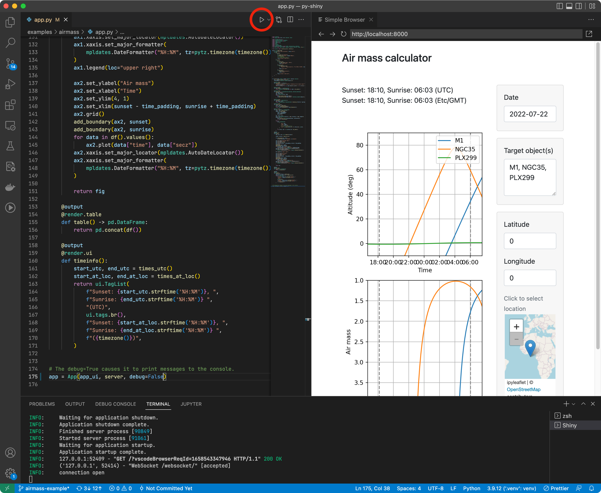

### Python packages

The `shiny` Python package can be installed via `pip` or `conda`.

::: {.panel-tabset .border-0 .p-0 .justify-content-center}

### pip

Before installing you may want to upgrade `pip` and install `wheel`:

```bash
pip install --upgrade pip wheel
```

Next, install `shiny` from PyPI.

```bash
pip install shiny
```

You may on occasion need to force installation of updated versions of our packages, since they are in development. This can be done with:

```bash
pip install --upgrade shiny htmltools
```

::: callout-note
### Virtual environments

For production apps, we recommend using a virtual environment to manage your dependencies. In this case, you should install `shiny` in your virtual environment scoped to your app, rather than globally. For example, if you are creating an app in a directory called `myapp`, you would create a virtual environment in that directory and install `shiny` there:

```bash
mkdir myapp
cd myapp
# Create a virtual environment in the .venv subdirectory
python3 -m venv .venv
# Activate the virtual environment
source .venv/bin/activate
```
:::

::: callout-note
### Development versions

If you want to install the development versions, you can do so with:

```bash
pip install https://github.com/posit-dev/py-htmltools/tarball/main
pip install https://github.com/posit-dev/py-shiny/tarball/main
```
:::


### conda

If you want to use a conda environment, feel free to create/activate one now:

```bash
# Create a conda environment named 'myenv'
conda create --name myenv

# Activate the virtual environment
conda activate myenv
```

Next, install `shiny` from conda-forge.

```bash
conda install -c conda-forge shiny
```

You may on occasion need to force installation of updated versions of our packages, since they are in development. This can be done with:

```bash
conda update -c conda-forge shiny
```

:::

## VS Code extensions

We recommend installing the [Python][vscode-python] and [Shiny][vscode-shiny] extensions for [Visual Studio Code][vscode]. Among other things, this will provide a play button in the top right corner of your editor that will run your Shiny app (more on this in the [Running apps](create-run.qmd) section).




### Type checking

If [type checking is important](https://john-tucker.medium.com/type-checking-python-306ad8339da1) to you, in addition to installing the [Python VSCode extension][vscode-python], you may want to do some additional configuration for a smooth experience with types in Shiny.

We recommend the following settings in your project's `.vscode/settings.json` file:

```default
{
    "python.analysis.typeCheckingMode": "basic",
    "python.analysis.diagnosticSeverityOverrides": {
        "reportUnusedFunction": "none"
    }
}
```

or alternatively, if your project keeps these settings in `pyrightconfig.json`:

```default
{
  "typeCheckingMode": "basic",
  "reportUnusedFunction":  "none",
}
```

The `basic` type checking mode will flag many potential problems in your code, but it does require an understanding of type hints in Python. This is the mode that is used by the [Shinylive](https://shinylive.io) examples editor. If you want to make even greater use of type checking, you can use `strict` mode:

```default
   "python.analysis.typeCheckingMode": "strict"
```

If you still find that too obtrusive and aren't used to working with type hints, you can remove that line entirely.

In the above configuration, we also disable the `reportUnusedFunction` diagnostic, as it's idiomatic Shiny to create named functions that are never explicitly called by any code (i.e., `@reactive.effect`).

You can also modify these settings on a per-file basis with comments at the top of the file. For example, you might have something like this at the the top of your `app.py`:

```default
# pyright: strict
# pyright: reportUnusedFunction=false
```

A full list of configuration settings for Pyright/Pylance is available [here](https://github.com/microsoft/pyright/blob/main/docs/configuration.md).

[vscode]: https://code.visualstudio.com/
[vscode-shiny]: https://marketplace.visualstudio.com/items?itemName=posit.shiny-python
[vscode-python]: https://marketplace.visualstudio.com/items?itemName=ms-python.python
