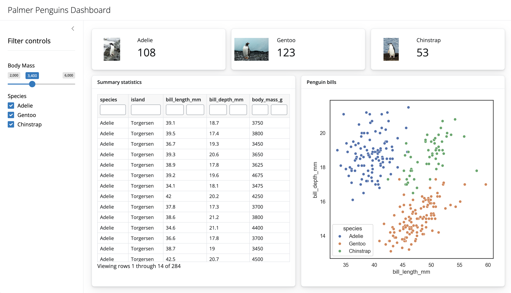

Welcome to the Shiny quick start guide!
After reading this article, you'll be able to get started creating basic Shiny apps.
In later articles, we'll build on these concepts to create more advanced apps, like the following dashboard:

).](assets/tipping-dashboard.png){class="img-fluid shadow rounded"}


### Basics {#basics}

Shiny apps typically start with [input components](/components/#inputs) to gather information from a user, which are then used to reactively render [output components](/components/#outputs). Here's a basic example that just displays a slider's value as formatted text.

```{shinylive-python}
#| standalone: true
#| components: [editor, viewer]
#| layout: vertical
#| viewerHeight: 150

from shiny import render
from shiny.express import input, ui

ui.input_slider("val", "Slider label", min=0, max=100, value=50)

@render.text
def slider_val():
    return f"Slider value: {input.val()}"
```

This example demonstrates the basic mechanics behind Shiny apps:

* Inputs are created via `ui.input_*()` functions.
    * The first argument is the input's `id`, which is used to read the input's value.
* Outputs are created by decorating a function with `@render.*`.
    * Inside a `render` function, `input` values can be read [reactively](#reactivity).
    * When those `input` values change, Shiny knows how to minimally re-render output.
* This example happens to use `shiny.express` which, [compared to core Shiny](express-vs-core.qmd), reduces the amount of code required.

::: {.callout-tip}
## Editable examples

Many examples on this site have an interactive code editor for modifying the source code for a Shiny app (which runs entirely in the browser, thanks to [shinylive](shinylive.qmd)).
If you'd like to run any examples locally, first [install](install.qmd) and [run](create-run.qmd) Shiny locally, then copy/paste relevant code into the `app.py` file (created by `shiny create .`).
:::

### Components {#components}

Shiny includes many useful user interface (`ui`) components for creating inputs, outputs, displaying messages, and more. For brevity sake, we'll highlight just a few output and layout components here, but for a more comprehensive list, see the [components gallery](/components).

#### Outputs {#outputs}

Shiny makes it easy to create plots, tables, and other interactive widgets. Simply decorate your matplotlib code with `@render.plot`, pandas-compatible data with `@render.data_frame`, or even [Jupyter Widgets](ipywidgets.qmd) with `@render_widget`. Here's a few examples, but for more, see [outputs section of the components gallery](/components/).

::: {.panel-tabset .panel-underline .border-0 .p-0 .justify-content-center}

##### Plots

```{shinylive-python}
#| standalone: true
#| components: [editor, viewer]
#| layout: vertical
#| viewerHeight: 480

from shiny import render
from shiny.express import input, ui

ui.input_selectize(
    "var", "Select variable",
    choices=["bill_length_mm", "body_mass_g"]
)

@render.plot
def hist():
    from matplotlib import pyplot as plt
    from palmerpenguins import load_penguins

    df = load_penguins()
    df[input.var()].hist(grid=False)
    plt.xlabel(input.var())
    plt.ylabel("count")

## file: requirements.txt
palmerpenguins
```


##### Tables

```{shinylive-python}
#| standalone: true
#| components: [editor, viewer]
#| layout: vertical
#| viewerHeight: 480

from shiny import render
from shiny.express import input, ui

ui.input_selectize(
    "var", "Select variable",
    choices=["bill_length_mm", "body_mass_g"]
)

@render.data_frame
def head():
    from palmerpenguins import load_penguins
    df = load_penguins()
    return df[["species", input.var()]]
## file: requirements.txt
palmerpenguins
```


##### Widgets

```{shinylive-python}
#| standalone: true
#| components: [editor, viewer]
#| layout: vertical
#| viewerHeight: 480

from shiny.express import input, ui
from shinywidgets import render_widget

ui.input_selectize(
    "var", "Select variable",
    choices=["bill_length_mm", "body_mass_g"]
)

@render_widget
def hist():
    import plotly.express as px
    from palmerpenguins import load_penguins
    df = load_penguins()
    return px.histogram(df, x=input.var())

## file: requirements.txt
palmerpenguins
plotly
```

<!--
##### Altair

```{shinylive-python}
#| standalone: true
#| components: [editor, viewer]

from shinywidgets import render_widget
from shiny.express import input, ui

ui.input_selectize(
    "var", "Select variable",
    choices=["bill_length_mm", "body_mass_g"]
)

@render_widget
def hist():
    import altair as alt
    from palmerpenguins import load_penguins
    df = load_penguins()
    return alt.Chart(df).mark_bar().encode(
        x=alt.X(f"{input.var()}:Q", bin=True),
        y="count()"
    )
## file: requirements.txt
altair
anywidget
palmerpenguins
```
-->

:::


#### Layouts {#layouts}

Shiny provides a handful of [layout components](/layouts) which help with arranging multiple inputs and outputs in a variety of ways. As seen below, with `shiny.express`, layout components (e.g., `ui.sidebar()`) can be used as context managers to help with nesting and readability.

::: {.panel-tabset .panel-underline .border-0 .p-0 .justify-content-center}

#### Sidebar

```{shinylive-python}
#| standalone: true
#| components: [editor, viewer]
#| layout: vertical
#| viewerHeight: 350
from shiny import render
from shiny.express import input, ui
import plotly.express as px
from shinywidgets import render_widget

ui.page_opts(title="Sidebar layout")

with ui.sidebar():
    ui.input_select("var", "Select variable", choices=["total_bill", "tip"])

@render_widget
def hist():
    return px.histogram(px.data.tips(), input.var())

## file: requirements.txt
pandas
```

#### Multi-page

```{shinylive-python}
#| standalone: true
#| components: [editor, viewer]
#| layout: vertical
#| viewerHeight: 350

from shiny import render
from shiny.express import input, ui
import plotly.express as px
from shinywidgets import render_widget

ui.page_opts(title="Multi-page example")

with ui.sidebar():
    ui.input_select("var", "Select variable", choices=["total_bill", "tip"])

with ui.nav_panel("Plot"):
    @render_widget
    def hist():
        return px.histogram(px.data.tips(), input.var())

with ui.nav_panel("Table"):
    @render.data_frame
    def table():
        return px.data.tips()

## file: requirements.txt
pandas
```

#### Multi-panel

```{shinylive-python}
#| standalone: true
#| components: [editor, viewer]
#| layout: vertical
#| viewerHeight: 350

from shiny import render
from shiny.express import input, ui
import plotly.express as px
from shinywidgets import render_widget

ui.page_opts(title="Multi-tab example")

with ui.sidebar():
    ui.input_select("var", "Select variable", choices=["total_bill", "tip"])

with ui.navset_card_underline(title="Penguins"):
    with ui.nav_panel("Plot"):
        @render_widget
        def hist():
            return px.histogram(px.data.tips(), input.var())

    with ui.nav_panel("Table"):
        @render.data_frame
        def table():
            return px.data.tips()

## file: requirements.txt
pandas
```

#### Multi-column

```{shinylive-python}
#| standalone: true
#| components: [editor, viewer]
#| layout: vertical
#| viewerHeight: 350
from shiny import render
from shiny.express import input, ui
import plotly.express as px
from shinywidgets import render_widget

ui.page_opts(title="Multi-column example")

ui.input_select("var", "Select variable", choices=["total_bill", "tip"])

with ui.layout_columns(height="300px"):
    @render_widget
    def hist():
        return px.histogram(px.data.tips(), input.var())

    @render.data_frame
    def table():
        return px.data.tips()

## file: requirements.txt
pandas
```

:::


::: {.callout-tip}
### Quarto integration

Shiny also integrates well with [Quarto](https://quarto.org/), allowing you to leverage its web-based output formats (e.g., [dashboards](https://quarto.org/docs/dashboards/interactivity/shiny-python/index.html)) in combination with Shiny outputs and reactivity.
:::


### Starter templates {#templates}

Once you've [installed](install.qmd) Shiny, the `shiny create` CLI command provides access to a collection of useful starter templates. This command walks you through a series of prompts to help you get started quickly with a helpful example. One great option is the dashboard template, which can be created with:

```bash
shiny create -t dashboard
```

{class="img-fluid shadow rounded"}

::: {.callout-tip}
## Example gallery

For more inspiring examples, check out the [example gallery](/gallery).
:::


### Reactivity {#reactivity}

Shiny's reactivity model is one of its most powerful and proven[^reactive-signals] features.
In the examples above, Shiny knows to re-execute `render` functions (i.e., update outputs) when the `input` values they depend upon change.
More generally, Shiny knows to re-execute a _reactive function_ when any of its _reactive dependencies_ change.
Reactive functions can not only render outputs, but also calculate intermediate values and perform side-effects.
Moreover, reactive dependencies can not only be client-side inputs, but also reactive Python functions and values.

[^reactive-signals]: Shiny's reactivity stands on the same foundational concepts formed and refined over decade in R/Shiny.
Those concepts were originally inspired by the [meteor framework](https://www.meteor.com/) and have more recently (re)-gained popularity in the JavaScript community through the [solidjs](https://www.solidjs.com/) project.

::: {.callout-tip}
## Compared to streamlit

Shiny's reactivity design inherently minimizes the amount of computation needed to keep outputs up-to-date, whereas streamlit requires you to explicitly manage this yourself with caching, which can be tedious and error-prone.
Read more in the [streamlit comparison](comp-streamlit.qmd).
:::

::: {.panel-tabset .panel-underline .border-0 .p-0 .justify-content-center}

#### Calculations

Often times in data-driven apps, it's useful to perform some data importing/manipulation steps _once_, then reuse those intermediate calculations across multiple views.
Shiny's `@reactive.calc` helps with this by creating a reactive calculation that only executes once when its dependencies change.

For example, the app below allows a user to upload a csv file, which is then used to render both a text and table output.
Notice how the reactive calculation, `df`, is read by both outputs, but the `read_csv()` happens only once per file upload.

::: {data-shinylive="https://shinylive.io/py/editor/#code=NobwRAdghgtgpmAXGKAHVA6VBPMAaMAYwHsIAXOcpMASxlWICcyACVKCAEygGcXe2nADoQAZo2IwWPABY0I2FnQbMWjOFEJkaANzh41lTnEYH1ARwMBXGiPGTpchRjgAPVOp59lTVvNRWZCIiNhj+gQD6ojQANnAAFEJg0XFJBkkAqqgxxFCc-CyEPDosKXBp-ISEcKhkALxJGEU6SQCUwRAAAuqa2npNUDGEIsaiLJyi8a2IIixzpSx1hubx4WQYZVPtEPOGZFaMO6icGD2cEc3xosAADAC6wADk3GRoUGQyj3fbIt1GJhgKK4glw4GMgWQpjMdvN1PtDqUkgBBFggCZTDCyNBwW53AC+rjRk1amJk2OAAEZ8eN3lBxLBymAOn9QYwMC8oFFGAyRmCWK8AEZxKGzWFweE7dSsjAAEVpAHFGDROPF0a1WmA8XcgA"}

```{python}
#| eval: false
import pandas as pd
from shiny import reactive, render, req
from shiny.express import input, ui

ui.input_file("file", "Upload a csv file", accept=".csv")

@reactive.calc
def df():
    # req() stops execution until input.file() is truthy
    f = req(input.file())
    return pd.read_csv(f[0]['datapath'])

@render.text
def text():
    return f"A {df().shape[0]}x{df().shape[1]} dataframe"

@render.data_frame
def table():
    return render.DataGrid(df())
```
:::

{class="img-fluid shadow rounded" style="margin-top: -1.5rem;"}

#### Side effects

TODO: a logging example?

```{shinylive-python}
#| standalone: true
#| components: [editor, viewer]
#| layout: vertical
#| viewerHeight: 150

from shiny import reactive
from shiny.express import ui

ui.input_slider("val", "Slider label", min=0, max=100, value=50)
ui.input_action_button("btn", "Click me")

@reactive.effect
def _():
    print(f"Slider val: {input.val()}")
```


#### Lazy computations

TODO: illustrate that Shiny doesn't run code that isn't needed for invisible outputs

```{shinylive-python}
#| standalone: true
#| components: [editor, viewer]
#| layout: vertical
#| viewerHeight: 150

from shiny.express import ui

with ui.nav_panel("Quick page"):
  "This is a quick page"

with ui.nav_panel("Slow page"):
  import time
  time.sleep(3)
  "This is a slow page"
```

:::

### Extensible foundation {#extensible}

Shiny is built on a foundation of web standards, allowing you to incrementally adopt custom HTML, CSS, and/or JavaScript as needed. In fact, Shiny UI components themselves are a Python representation of HTML/CSS/JavaScript, which you can see by printing them in a Python REPL:

```python
>>> from shiny import ui
>>> ui.input_action_button("btn", "Button")
<button class="btn btn-default action-button" id="btn" type="button">Button</button>
```

As learn more about in extending Shiny, inputs and outputs communicate with the Python backend via Shiny's binding API, which can accomodate any JavaScript framework like React or Vue.


```{=html}
<style>
.link-shinylive {
  position: absolute;
  bottom: 0;
  right: 0.5em;
  background-color: unset;
  font-family: var(--bs-font-sans-serif);
}
</style>
<script>
document.addEventListener("DOMContentLoaded", function() {
  // Add shinylive links to code blocks
  document.querySelectorAll("[data-shinylive]").forEach(function(el) {
    let pre = el.querySelector("pre");
    const link = document.createElement("a");
    link.classList.add("link-shinylive");
    link.target = "_blank";
    link.rel = "noopener noreferrer";
    link.href = el.dataset.shinylive;
    link.innerHTML = `<i class="bi bi-lightning-fill"></i> Run on shinylive`;
    pre.appendChild(link);
  });
  // Add nav-underline to panel-underline where appropriate
  document.querySelectorAll('.panel-underline .nav').forEach((x) => {
    x.classList.remove("nav-tabs");
    x.classList.add("nav-underline");
    x.classList.add("justify-content-center");
  });
});
</script>
```
